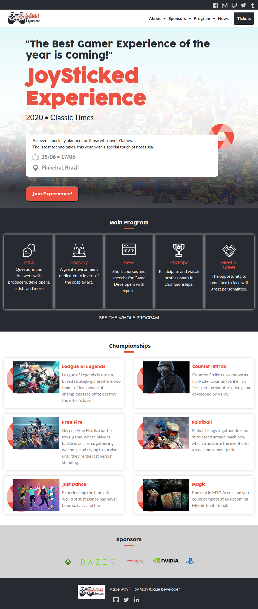
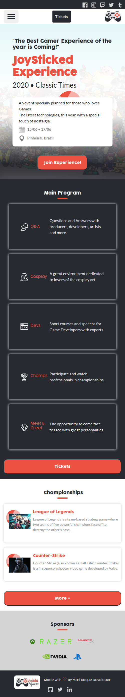

# JoySticked Experiece 

> This project is a website for a fictitious Gamer Event.

This is my capstone project for the HTML5/CSS3 module from Microverse Curriculum.

 The design should be inspired on the design created by [Cindy Shin in Behance](https://www.behance.net/adagio07)

 ## Desktop Version

 

 ## Mobile Version
    
 

## Requirements

Build these 3 pages as the minimum requirements:

- the main page, with a menu link to the about page and tickets page
- the about page
- the tickets page

 

Each of these pages should have versions for 2 different screen sizes: 

- mobile: up to 768px
- desktop: from 768px

Follow the guidelines of the given design, including:

- colors
- typographies: font face, size and weight
- layout: composition and space between elements, for the 2 given screen sizes

## Built With

- CSS3 and HTML5

## Live Demo

[Live Demo Link](https://raw.githack.com/MarilenaRoque/JoyStickedExperience/develop/index.html)

## Author

👤 **Marilena Roque**

- Github: [MarilenaRoque](https://github.com/MarilenaRoque)
- Twitter: [@MariRoq88285995](https://twitter.com/MariRoq88285995)
- Linkedin: [roquemarilena](https://www.linkedin.com/in/roquemarilena/)

## 🤝 Contributing

Contributions, issues and feature requests are welcome!

Feel free to check the [issues page](issues/).

## Show your support

Give a ⭐️ if you like this project!

